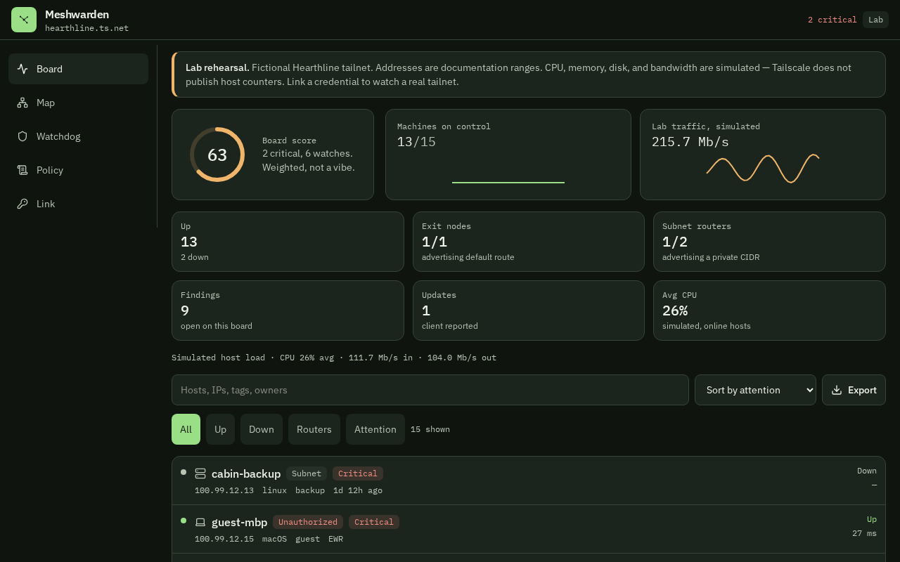
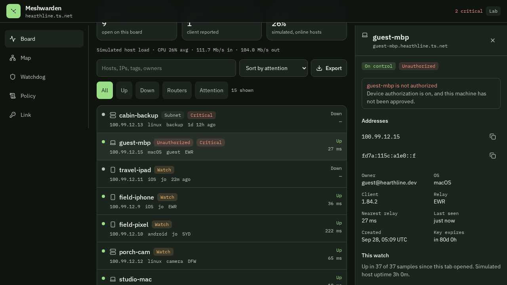

# Meshwarden

A watcher for a [Tailscale](https://tailscale.com) tailnet. It lists every device the control plane reports, scores the fleet, and lets you rehearse admin actions on a fictional network before you point it at a real one.

It is a web app. On Android, open it in Chrome and choose **Install app** or **Add to Home screen**. That gives you a full-screen icon. It is not a Play Store package, and it is not the Tailscale VPN client.



## What it shows

| View | Purpose |
| --- | --- |
| Board | Health score, who is up, median DERP latency, a searchable fleet, and an incident log |
| Map | The same devices, grouped by tag or owner |
| Watchdog | Thresholds, and the findings those thresholds produce |
| Policy | The ACL file, MagicDNS, resolvers, and search paths, when the credential can read them |
| Link | Stay in the lab, or hand over a live credential |

Press `/` to jump to fleet search. Press Escape to close the inspector when no dialog is open.

Open a device for addresses, keys, routes, and control-plane latency. In the lab you also get CPU, memory, disk, and bandwidth. **Live mode does not invent those.** Tailscale’s device API does not return host CPU or interface counters, so those fields stay blank on a real tailnet.




## Two modes

### Lab

The app opens on `hearthline.ts.net`, a made-up tailnet of fifteen hosts. Two findings start critical: a subnet router that has left the control plane, and a key that is about to expire. Telemetry is simulated and ticks about every two seconds.

You can authorize a machine, expire a key, change enabled routes, or delete a device. Those edits live in the tab. **Reset lab** on the Link view restores the original fifteen hosts.

### Live

On Link, choose **Live tailnet** and provide either:

- an API access token, or
- an OAuth client id and secret (client-credentials grant)

Use `-` as the tailnet name to follow whichever tailnet the credential belongs to, or type a tailnet such as `example.com`.

Polling is 15, 30, or 60 seconds. Meshwarden reads:

- devices (`fields=all`): presence, last seen, client version, update available, DERP region and latency, addresses, tags, routes, key expiry, authorization
- DNS nameservers, MagicDNS, and search paths
- the ACL / policy file

A 403 on DNS or the policy file is reported as a note. The device list still loads.

Actions stay off until you arm them, then confirm by typing the hostname:

- authorize or unauthorize a device
- expire a node key
- set the enabled routes
- delete the device from the tailnet

Delete is permanent on Tailscale’s side. Arm the switch only when you mean to change production.

## Security

The credential is held in memory for that browser tab. It is not written to disk, a database, or `localStorage`. Closing the tab drops it. Refreshing the page drops it too.

The browser never calls `api.tailscale.com` itself. Server functions proxy a fixed list of paths:

- `GET /api/v2/tailnet/{tailnet}/devices`
- `GET /api/v2/tailnet/{tailnet}/dns/nameservers`
- `GET /api/v2/tailnet/{tailnet}/dns/preferences`
- `GET /api/v2/tailnet/{tailnet}/dns/searchpaths`
- `GET /api/v2/tailnet/{tailnet}/acl`
- `POST /api/v2/oauth/token`
- `POST /api/v2/device/{id}/authorized`
- `POST /api/v2/device/{id}/expire`
- `POST /api/v2/device/{id}/routes`
- `DELETE /api/v2/device/{id}`

Anything else is rejected before a request is sent. `machineKey`, `nodeKey`, and `tailnetLockKey` are stripped before a device reaches the page. Error text is redacted so a token is not echoed back. Calls are capped per credential, and each upstream request times out after 15 seconds.

The only browser storage is preferences: watchdog rules, poll interval, tailnet name, and whether you last picked a token or OAuth. Not the secret.

Prefer a read-only credential if you only want to watch. Tailscale’s OAuth scopes are documented in [OAuth clients](https://tailscale.com/kb/1215/oauth-clients). A watch-only client typically needs read scopes for devices, routes, DNS, and the policy file (`devices:core:read`, `devices:routes:read`, `dns:read`, `policy_file:read`). Grant write scopes only if you will arm actions, and confirm the names in the admin console — Tailscale owns that list, not this app.

This is a careful dashboard, not a security audit of Tailscale and not a place to paste a credential you would not trust a server you operate with.

## Run it

Node 22 or newer.

```bash
npm install
npm run dev
```

The dev server listens on port 8080. Meshwarden does not need a database. `npm run build` skips migrations when `DATABASE_URL` is unset.

```bash
npm run typecheck
npm run build
```

## Layout

```text
src/components/mesh/   Board, map, inspector, watchdog, policy, link
src/lib/mesh/          Types, lab fleet, watchdog, Tailscale proxy, store
```

The lab fleet and the finding rules are the source of truth for what the rehearsal shows. Live devices are normalized from the [Tailscale API](https://tailscale.com/kb/1101/api) and then run through the same watchdog.

## Android

The same dashboard can be installed on a phone without a Meshwarden server. Lab mode is inside the app and works with no network. Live mode calls `api.tailscale.com` from the phone. The credential stays in memory for that session and is not written to disk.

It is not a Play Store app, and it is not the Tailscale VPN client. Android will warn that the package came from outside the store. Install only a copy you trust. If a later build is signed with a different key, uninstall this one before installing the new one.

The installable package is produced from `android/` after `npm run build:android`. It is not committed here.

- Not a coordination server, subnet router, or exit node.
- Not a source of live host CPU, memory, or bandwidth. Those series exist so the lab inspector is worth looking at.
- Not an account system. There is no Meshwarden sign-in. Your Tailscale credential is the only login, and it stays in the tab.
